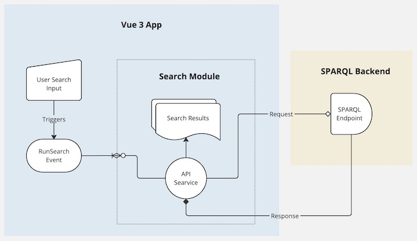

# Getty GETter

This project represents my first attempt at building a Vue 3 application and is my code sample submission to members of the search committee and Collections Platforms & Data department at [the Getty Research Institute]([https://www.getty.edu/](https://www.getty.edu/research/)). Documented in a "code-journaling" style, the READMEs and code comments found throughout will hopefully clarify my reasoning in the app's design. The repo is intended for a limited audience and the docs assume the reader is familiar with [Vue](https://vuejs.org/) and [Vite](https://vite.dev/).

If you'd like to skip the pre-amble and get straight to the docs, See *[Reading the source](#reading-the-source)*. 

## The Challenge

> In roughly a day's worth of work, build an app that features a UI component, populated with data from [UAAT](https://www.getty.edu/research/tools/vocabularies/aat/), [ULAN](https://www.getty.edu/research/tools/vocabularies/ulan/index.html), or any other [Getty API](https://data.getty.edu/).

The first time I built with Vue was [earlier this month](https://github.com/8bitsquid/getty-vue-project). Liking a good challenge, I decided to build the "day's work" app using Vite + Vue 3. After reading through Vue/Vite docs, poking around the [Getty Vocabularies: LOD](https://vocab.getty.edu/), and trying to decipher some [almost alchemical](https://vocab.getty.edu/queries#All_Data_For_Subject) SPARQL queries from the Getty Vocab docs, the goal in my mind was set. 

## The Goal

In roughly ~8hr(ish), build a search/query UI over the [vocab.getty.edu/sparql.json](https://vocab.getty.edu/sparql) endpoint. ~8hrs is a bit short of a full-featured search UI for complex data, so why not build a simple app designed with extensibility in mind, like I did with [my previous frontend work](#my-frontend-experience). I read deep into the vue docs and will try my best to create a bare-bones app that lays the foundations for a true production app.

## App Outline
From the browser, the user submits a search string in the app. Submitting triggers a `RunSearch` event that other components can listen for. `RunEvent` passes the search string to the API service, which queries the SPARQL endpoint, then awaits a response. After recieving an "ok" from the backend, the response data is put in a reactive property at the app level, where other componantents can track changes.


## Reading the source

### Just Follow the READMEs
The source may be best read from Github, as you can follow the links in the `README` files. Each `REAMDE.md` describes the general purpose, layout, etc..., of the files in the same directory and typically links to other `README`s. For implementation details, check the comments in the source files.

The [src/README](src/README.md) is a good place to start.

## Running the App

```bash
# Clone the repo and `cd` into project root
$ git clone https://github.com/8bitsquid/gettygetter.git && cd gettygetter

# Install Node dependencies, build, and run preview
$ npm install
$ npm run build && npm run preview

```

### Testing
```bash
$ npm run test
```

## Lessons Learned

### Time's up

Ok, total dev time was more ~10hrs. But be honest, I've had many ~~10hr days before.

### Unused Parts
The app is complete and runnabnle. However, new toys tempted scope creep, and I started pre-planning other features. 
I left the stubs for these features in for context and hopefully they'll serve as examples of how I would add new modules.

* [pagination composable](src/core/composables//pagination.js) to handle paging state for a pagination component.
* The [query](src/query) top level module would allow submitting SPARQL queries directly.

### Too many toys
As with many modern apps, the number of tools and frameworks used may inflate dev time if breaking chagings come down the line. Learning the tools and having templated configsnd scaffolding is key to reducing toil. 

I hoped to cut time using a framework like  [Elemnt Plus](https://element-plus.org/en-US/) was the main offender in adding unneeded complexity to the project. The components offered looked promising, but implementation of some was much more complex than anticipated and ate in the time-limit. In the future, it's probably better to use more stripped down frameworks for projects like this.

#### Element Plus + Vue + Vite + Code Challenge == 🪢
Being new to the `vite + vue` ecosystem added to the challenge. Having done multiple game jams, I do enjoy a good sprint from time to time. However, I laied my hopes on a specific feature of a third-party module in hopes to impress. After seeing the [expandable row](https://element-plus.org/en-US/component/table.html#expandable-row) examples for Element Plus's `el-table`, I became convinced that by using the expandable rows to render summaries for each item, dynmically loading from the item's URI and preprocessing with [linkedart.js](https://www.linkedartjs.org/) before sending data to the template, would be the path to success, but all the other new challenges nibbled through the remaining time.

#### Styles and WCAG improvements

Styles need work and body text is way too faint. I was looking for a Vue centric alternative to Bootstrap, but ElementPlus is designed more to be a component library with some styling, rather than a style framework with some components. Improvements [have been mentioned](https://github.com/element-plus/element-plus/discussions/1697), but more more vetting would need to be dome before I would recomment for production.


## Credits

This ideas in this project hopefully represent my ability to grok the documentation and standards available in the amazing work published by the Vue/Vite/Vue-* ecosystem, The Getty Research Institute, and greater opensource community. 
I found myself turing to these resources most often.

* [The Getty Vocabularies](https://vocab.getty.edu/)
* [Getty's API Documentation](https://data.getty.edu/)
* [Vuejs.org](https://vuejs.org/guide/introduction.html)
* [the Vite Guide](https://vite.dev/guide/)
* [Element Plus](https://element-plus.org/en-US/guide/design.html)

## Notes

#### My Frontend Experience

I was given the option to present a front-end app I had written professionally but unfortunately, I don't have any show-able front-end work from the last few years *(read: Trapped in private repos)*

I have gotten deeper into backend development recently, but I have deep roots in front-end development. Specifically with [AngularJS](https://angularjs.org/). 
The University of Alabama Libraries still uses most of the AngularJS apps I built during my time there as a Senior Fullstack Engineer. 
Perhaps most notably the "bento box" search component [OneSearch](https://www.lib.ua.edu/#/bento/J.%20Paul%20Getty) - a modular, configurable, and pluggable federated search app. OneSearch made adding new search engines to the frontend easy - just [5 simple steps](https://ualibweb.github.io/oneSearch_ui/#/api/engines). 

